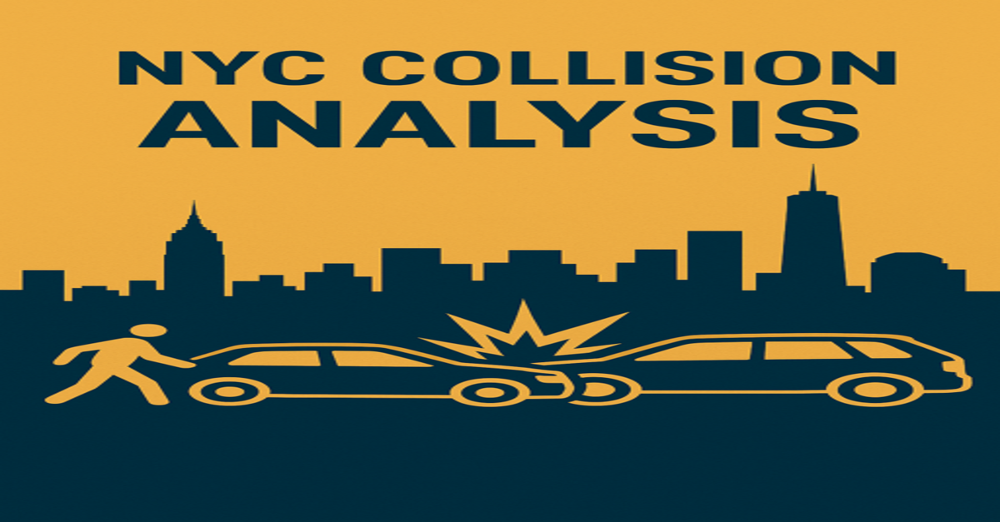

# Nyc-Collision-Analysis

## Project Overview

This project provides a detailed analysis of motor vehicle collisions reported by the New York City Police Department (NYPD) between the year 2021 and 2023. The primary objective was to identify key trends, high-risk locations, and common causes of accidents to derive actionable insights for improving road safety. The entire analysis, from data cleaning to visualization, was conducted using Microsoft Excel.

## Key Performance Indicators (KPIs) Established

To monitor road safety effectively, the following KPIs were established from the data:

1. Total Collision

2. Fatality Rate per 1,000 collisions

3. Injury Rate 1,000 collisions

4. Peak Time Accident Frequency

## Skills Demonstrated

The following Excel Features were incorporated

- Data Cleaning & Transformation
- Data Aggregation
- Data Analysis
- Data Visualization

## Visualization 

## Analysis & Findings

### Monthly Accident Trends
- Analysis: The total number of accidents was aggregated by month to identify any seasonal patterns.
  
- Finding: A significant rise of 10.53% collision rate was observed in March. Which was an 18.56% increase in accident compared to February

  ### Peak Times for Accidents
- Analysis: Accident frequency was analyzed across both the day of the week and the hour of the day.
  
- Finding: Accident frequency peaked on during the weekend specifically between 2 PM and 8 PM. This highlights the risk associated with peak commuter traffic. The single most frequent time for accidents was Friday at 4 PM.
  
### High-Risk Locations
- Analysis: Accidents were grouped by Street name and Borough to identify the streets and borough with the highest number of reported incidents.
  
- Finding: The most accidents were reported on Belt Parkway Street and Brooklyn Borough. This single street accounted for 1.56% of all collisions in this dataset, making it a critical hotspot for safety interventions.
  
### Common Contributing Factors
- Analysis: The primary contributing factor for all accidents was identified. A separate, filtered analysis was conducted for fatal accidents.

- Finding (All Accidents): The most common contributing factor for all collisions was Driver Inattention/Distraction. This suggests that driver behavior is a leading cause of accidents.
  
- Finding (Fatal Accidents): For fatal accidents specifically, the most common contributing factor was Unsafe Speed. This indicates that while distraction causes many accidents, other, more dangerous behaviors are more likely to lead to fatalities.

You can Interact with the the final Excel workbook [HERE](https://docs.google.com/spreadsheets/d/11sy-rX3AA-7_bFzb8sVUFlA_wfEd2EDf/edit?usp=sharing&ouid=113899812595520572790&rtpof=true&sd=true)

## Recommendations

Based on the analysis, the following actions are recommended to enhance road safety in NYC:

- Increase traffic enforcement presence during peak accident hours (weekdays, 2 PM - 8 PM), focusing on violations that could lead to common collisions.
- Deploy dedicated patrols and speed enforcement initiatives along identified high-risk Streets and Boroughs, particularly the Belt Parkway street and the Brooklyn borough.
- Implement traffic calming measures on high-risk streets, which could include better lane markings, higher visibility crosswalks, or consideration of speed camera installations where appropriate.
- Launch a city-wide public safety campaign focused specifically on the most common contributing factor of accidents: Driver Inattention/Distraction. Campaigns should run on media channels that reach drivers during their commute (e.g., radio, digital billboards).
- Develop separate, more impactful messages around the leading causes of fatal accidents, such as unsafe speed, to highlight the life-threatening consequences of such behavior.

### Connect with me via my [LinkedIn](www.linkedin.com/in/oyindamola-ayeni)

